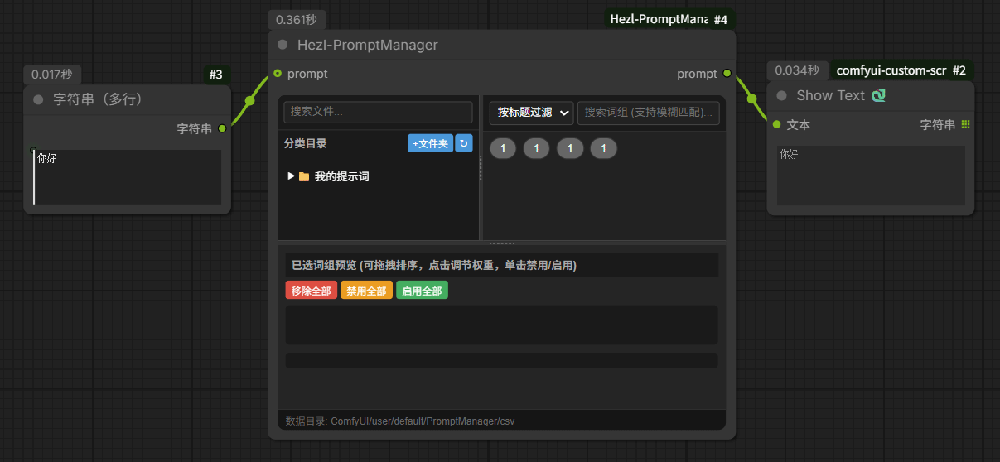
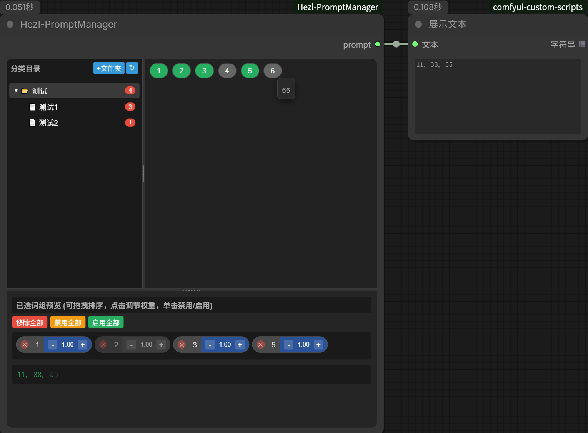

# ComfyUI_Hezl-PromptManager_Fix   
### 关于 ComfyUI 提示词管理器 ( Fix 美化增强版 )    
这是一个以文件夹层级分类,csv数据结构,来构筑的提示词插件  

  


## 变更内容: 与原仓库 260317 的 Fix 修改内容：  
1.为防止数据因升级插件丢失,数据迁移至 ComfyUI\user\PromptManager\csv 目录.  
2.增加文件搜索,标签和内容搜索.  
3.增加提示词输入节点,支持输入提示+提示词组合输出  
4.修复鼠标事件产生的BUG  
5.修复同名标签选择BUG  
6.优化部份操作体验,增加滚动条  
7.数据csv存储采用简单文本加密,简易隐私保护 (无法用记事本查看)  
8.切换工作流现在会恢复数据  
9.样式美化操作体验更舒适  
10.优雅处理标签排列更精美
11.修复已选词组滚动区问题    

> 附带工作流:  workflows\提示词管理器工作流.json  
  
  
## 更新  
### 260317
1.将Comfyui节点自带的"prefix""suffix"去掉  
2.功能按钮全部转移到右键菜单,右键对应的选项可查看其功能  
3."词组显示"窗口改为胶囊式,更节省空间,在选中单个csv文件时可拖拽移到来改变csv文件里的词组排序  
4.各个窗口之间可以自由拖动边界,可改变窗口大小  
5.更改UI,使其更好使用,避免误触  


### 260308  
1.优化拖拽效果  
2.添加了按钮"新建csv",只能在选中文件夹状态下使用  
3.修复了"文件夹"和"csv"词组选中状态不一致  
4.修复重起Comfyui后不读取csv数据,使词组为不选中状态  
5.修复无法取消分类目录的选中状态  
  

## 使用  
  
### 功能
1. 以本地文件夹形式分类，读取csv  
2. 可勾选多个词组，并可在【预览模块】里移动顺序和权重调节  
3. 分类目录：点击文件夹会遍历此文件夹下的所有csv文件，想要单独读取就展开点击单个csv文件
4. 文件夹统计已勾选的词组，点击可取消勾选此文件夹已勾选的词组

### csv提示词数据  
原数据路径 【```\Comfyui_Hezl-Prompt\csv】  
数据迁移至 ComfyUI\user\PromptManager\csv ( 特别注意! )

|title|content|
| ----------- | ----------- |
|标题 (1个单词)|1个单词|
|标题 (词组)|"单词01,单词02,···"|


### 最后感谢: 本节点基于 Hezldeen 仓库 260317 进行BUG修复和功能修改:
> 因为是按自己的使用习惯进行了修改, 如果原作者需要, 也可以当成 PR 提交．   
感谢原作者 Hezldeen 提供如此精彩的插件: https://github.com/Hezldeen/ComfyUI_Hezl-PromptManager  
说明：本仓库的功能修改，均由AI辅助完成．

  

